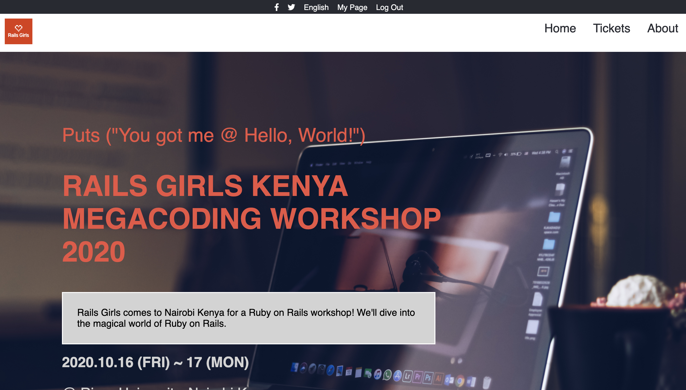
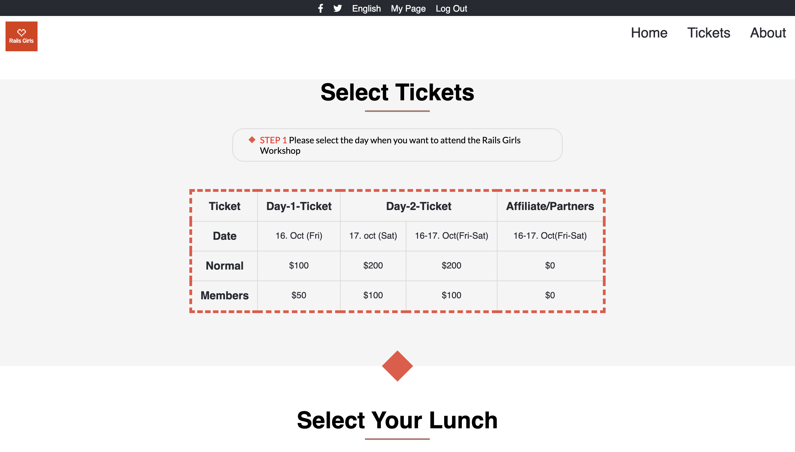
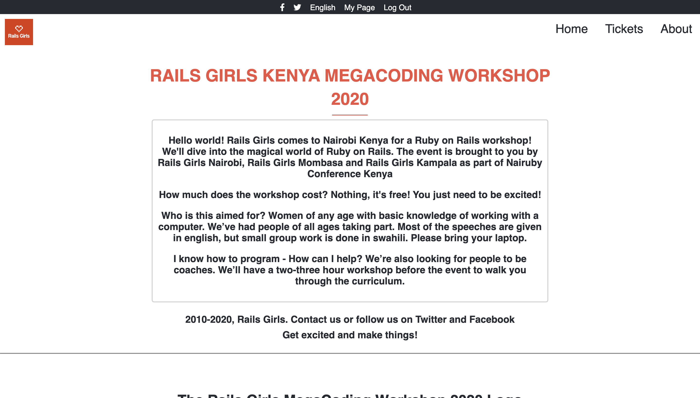

# Html-Css-Capstone-Project
Capstone projects are solo projects at the end of the each of the Microverse Main Technical Curriculum sections.

> 

> 

> 

## Built With

- HTML & CSS.

## Live Demo

[Live Demo Link](https://rawcdn.githack.com/imahnama/Html-Css-Capstone-Project/53b6b09924af31fa7fc401a48adc2a85f76fc8b7/index.html)

## Live Video

[ Video Presentation](https://www.loom.com/share/b579678f332f413d943cf4c573753693)

## Getting Started

To get a local copy up and running follow these simple example steps.

### Prerequisites

A browser of your choice preferrably Chrome.

### Setup

Fork this project to your local machine
Open the index.html file in any browser or edit using Atom Editor or the preference IDE for web development

## Author

👤 **Rahma Halane**

- Github: [@Imahnama](https://github.com/imahnama)
- Twitter: [@halane_rahma](https://twitter.com/halane_rahma)
- Linkedin: [Rahmahalane](https://linkedin.com/Rahmahalane)

## 🤝 Contributing

Contributions, issues and feature requests are all welcome! Start by:

Forking the project
Cloning the project to your local machine
cd into the project directory
Run git checkout -b your-branch-name
Make your contributions
Push your branch up to your forked repository
Open a Pull Request with a detailed description to the development branch of the original project for a review
Please feel free to contribute to any of these!

Feel free to check the [issues/](https://github.com/imahnama/Html-Css-Capstone-Project/issues).

## Show your support

Give a ⭐️ if you like this project!!

## Acknowledgments

- Freecodecamp
- w3schools
- The [Original design](https://www.behance.net/gallery/29845175/CC-Global-Summit-2015) is attributed to [Cindy Shin on Behance](https://www.behance.net/adagio07)

## 📝 License

The original design is licenced under the Creative Commons 4.0 licence
